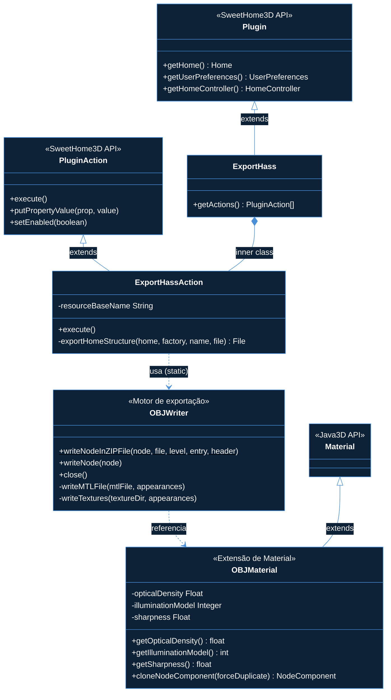
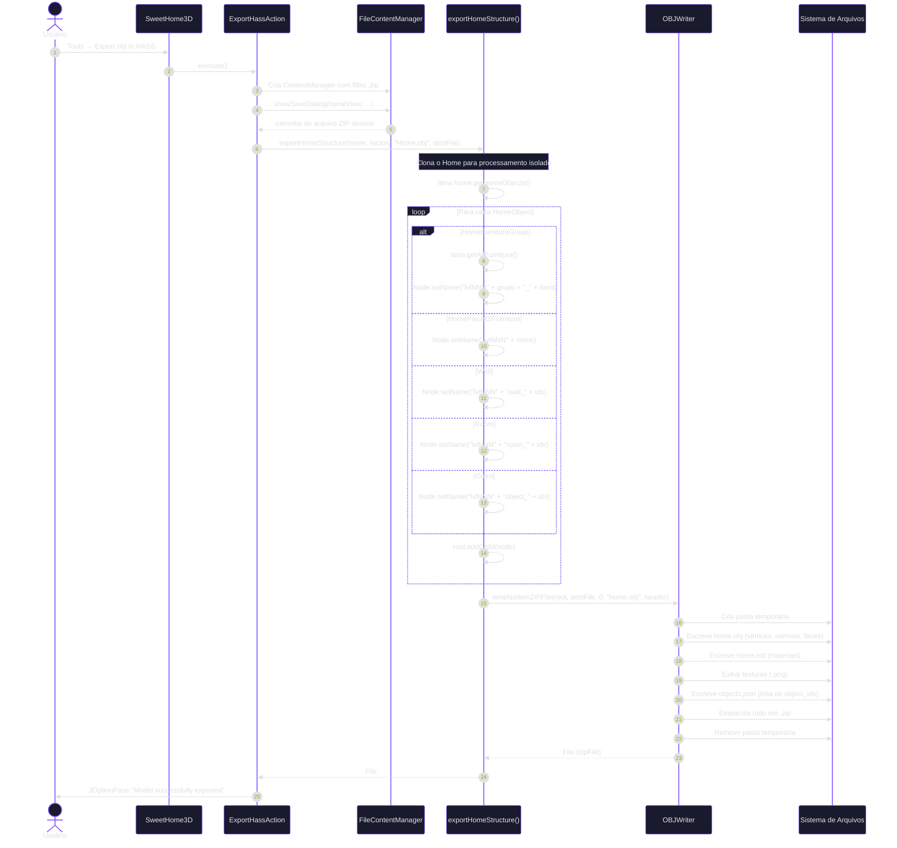
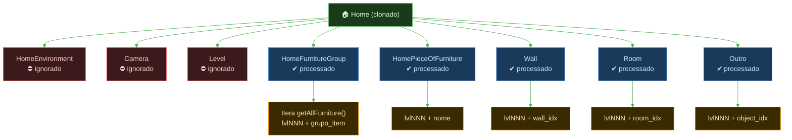
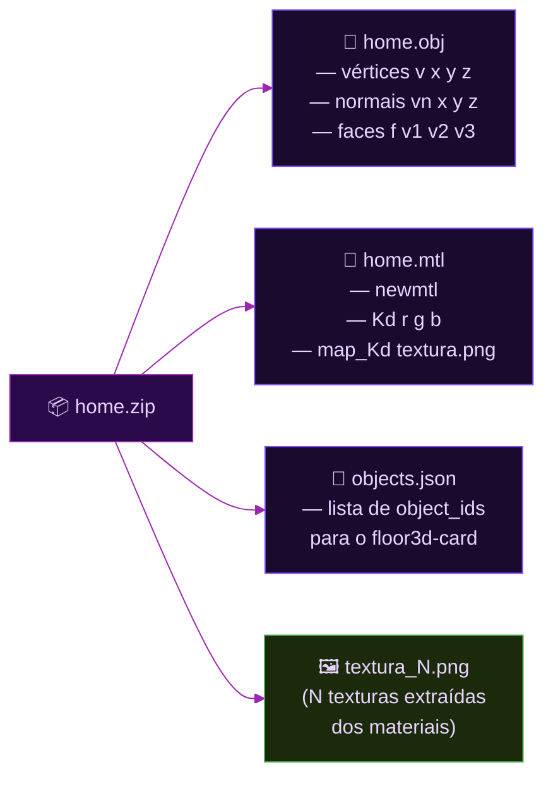
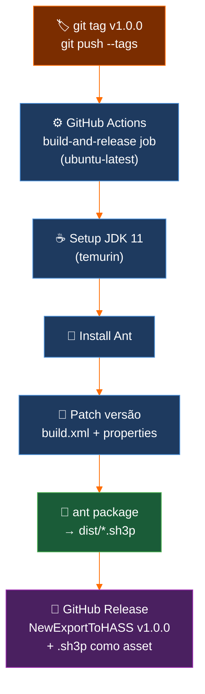
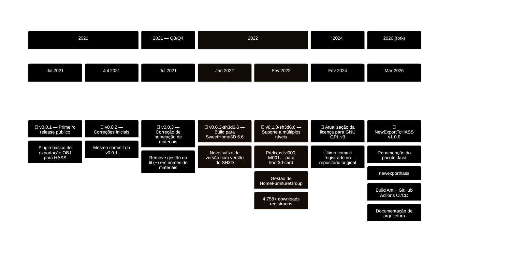

# Arquitetura — NewExportToHASS

> **Fork de** [adizanni/ExportToHASS](https://github.com/adizanni/ExportToHASS)
> **Versão:** 1.0.0 | **Licença:** GNU GPL v3 | **Java target:** 1.7 | **SweetHome3D mínimo:** 6.5

---

## Sumário

1. [Visão geral](#1-visão-geral)
2. [Estrutura do repositório](#2-estrutura-do-repositório)
3. [Arquitetura de componentes](#3-arquitetura-de-componentes)
4. [Fluxo de execução](#4-fluxo-de-execução)
5. [Modelo de dados](#5-modelo-de-dados)
6. [Pipeline de build e release](#6-pipeline-de-build-e-release)
7. [Formato de saída (.sh3p / ZIP)](#7-formato-de-saída-sh3p--zip)
8. [Diferenças em relação ao ExportToHASS original](#8-diferenças-em-relação-ao-exporthass-original)
9. [Timeline do repositório original](#9-timeline-do-repositório-original)

---

## 1. Visão geral

O **NewExportToHASS** é um plugin para o SweetHome3D que exporta modelos 3D domésticos para o formato Wavefront OBJ, estruturado especificamente para integração com o [`floor3d-card`](https://github.com/adizanni/floor3d-card) do Home Assistant.

```mermaid
%%{init: {"theme": "base", "themeVariables": {"primaryColor": "#1e3a5f", "primaryTextColor": "#ffffff", "primaryBorderColor": "#4a90d9", "lineColor": "#4a90d9", "secondaryColor": "#2d6a9f", "tertiaryColor": "#0d2137"}}}%%
graph LR
    classDef sh3d fill:#1e3a5f,stroke:#4a90d9,color:#fff,rx:8
    classDef plugin fill:#1a5c38,stroke:#4caf50,color:#fff,rx:8
    classDef hass fill:#7b2d00,stroke:#ff6d00,color:#fff,rx:8
    classDef output fill:#4a2060,stroke:#9c27b0,color:#fff,rx:8

    SH3D["🏠 SweetHome3D\nModelo 3D"]:::sh3d
    PLUGIN["🔌 NewExportToHASS\nPlugin"]:::plugin
    ZIP["📦 home.zip\n(OBJ + MTL + texturas + JSON)"]:::output
    HASS["🏡 Home Assistant\n/config/www/"]:::hass
    CARD["📱 floor3d-card\nVisualização 3D"]:::hass

    SH3D -- "Tools → Export obj to HASS" --> PLUGIN
    PLUGIN -- "Gera" --> ZIP
    ZIP -- "Usuário descompacta" --> HASS
    HASS --> CARD
```



**Problema resolvido:** O plugin original usa nomes de objeto definidos pelo usuário (em vez de índices auto-gerados) para garantir IDs estáveis entre exportações. Este fork renomeia o pacote Java e o identificador do plugin para permitir coexistência com o ExportToHASS original instalado simultaneamente.

---

## 2. Estrutura do repositório

```
NewExportToHASS/
├── src/
│   └── com/eteks/sweethome3d/plugin/
│       └── newexporthass/                  ← pacote renomeado (era: exporthass)
│           ├── ExportHass.java             ← ponto de entrada do plugin
│           ├── OBJWriter.java              ← motor de exportação OBJ/MTL
│           ├── OBJMaterial.java            ← extensão de material para ray-tracing
│           └── ApplicationPlugin.properties← descriptor lido pelo SweetHome3D
├── .github/
│   └── workflows/
│       └── release.yml                     ← CI/CD: build + GitHub Release automático
├── docs/
│   └── architecture.md                     ← este documento
├── build.xml                               ← script Ant para compilar e empacotar
├── SweetHome3D-6.6.jar                     ← dependência principal (framework)
├── j3dcore.jar                             ← Java3D — core
├── j3dutils.jar                            ← Java3D — utilitários
├── vecmath.jar                             ← matemática vetorial
├── json-20210307.jar                       ← serialização JSON
├── README.md
└── LICENSE                                 ← GNU GPL v3
```

---

## 3. Arquitetura de componentes



### Responsabilidades

| Classe | Responsabilidade |
|---|---|
| `ExportHass` | Ponto de entrada; registra a ação no menu do SweetHome3D |
| `ExportHassAction` | Controla o diálogo de arquivo e orquestra a exportação |
| `OBJWriter` | Converte a cena Java3D para OBJ/MTL e empacota em ZIP |
| `OBJMaterial` | Estende `javax.media.j3d.Material` com propriedades extras de ray-tracing |

---

## 4. Fluxo de execução



---

## 5. Modelo de dados

### Hierarquia de objetos exportados



### Estrutura do ZIP exportado



---

## 6. Pipeline de build e release



### Build local

```bash
# Pré-requisito: JDK 7+ e Ant instalados
ant clean    # limpa bin/ e dist/
ant compile  # compila src/ → bin/
ant package  # empacota bin/ → dist/NewExportToHASSPlugin-1.0.0-sh3d6.6.sh3p
ant          # alias: clean + compile + package
```

### Ciclo de release via tag

```bash
git tag v1.0.0
git push origin v1.0.0
# → GitHub Actions detecta a tag e cria o release automaticamente
```

---

## 7. Formato de saída (.sh3p / ZIP)

O arquivo `.sh3p` é um arquivo ZIP consumido diretamente pelo SweetHome3D. Estrutura interna:

```
NewExportToHASSPlugin-1.0.0-sh3d6.6.sh3p
├── ApplicationPlugin.properties    ← descriptor na raiz
├── com/
│   └── eteks/
│       └── sweethome3d/
│           └── plugin/
│               └── newexporthass/  ← pacote renomeado
│                   ├── ExportHass.class
│                   ├── ExportHass$ExportHassAction.class
│                   ├── OBJWriter.class
│                   ├── OBJWriter$ComparableAppearance.class
│                   └── OBJMaterial.class
└── lib/
    └── json-20210307.jar           ← dependência empacotada
```

**Campos críticos em `ApplicationPlugin.properties`:**

```properties
name=New Export Wavefront Obj for HASS   # identificador único do plugin
class=com.eteks.sweethome3d.plugin.newexporthass.ExportHass
version=1.0.0
applicationMinimumVersion=6.5
javaMinimumVersion=1.5
```

---

## 8. Diferenças em relação ao ExportToHASS original

| Aspecto | ExportToHASS (original) | NewExportToHASS (fork) |
|---|---|---|
| **Pacote Java** | `com.eteks.sweethome3d.plugin.exporthass` | `com.eteks.sweethome3d.plugin.newexporthass` |
| **Nome do plugin** | `Export Wavefront Obj for HASS` | `New Export Wavefront Obj for HASS` |
| **Versão inicial** | `0.1.0` | `1.0.0` |
| **Arquivo .sh3p** | `ExportToHASSPlugin.sh3p` | `NewExportToHASSPlugin-<ver>-sh3d6.6.sh3p` |
| **Build system** | Eclipse manual | Ant (`build.xml`) |
| **CI/CD** | Nenhum | GitHub Actions (`release.yml`) |
| **Coexistência** | Conflita com o fork se ambos instalados | Coexiste com o original sem conflito |
| **Docs** | README básico | README + `docs/architecture.md` |

> As classes, lógica de exportação e comportamento funcional são **idênticos** ao upstream. Apenas o namespace e a infraestrutura de build foram alterados.

---

## 9. Timeline do repositório original

A linha do tempo abaixo documenta a evolução do repositório [adizanni/ExportToHASS](https://github.com/adizanni/ExportToHASS), do qual este fork deriva.



### Detalhamento das versões upstream

| Tag | Data | Destaques |
|---|---|---|
| `v0.0.1` | Jul 2021 | Primeira versão pública; exportação básica OBJ/MTL/ZIP |
| `v0.0.2` | Jul 2021 | Mesmo commit; tag alternativa para distribuição inicial |
| `v0.0.3` | Jul 2021 | Remove tratamento de til (`~`) em nomes de materiais |
| `v0.0.3-sh3d6.6` | Jan 2022 | Recompilação com SweetHome3D 6.6; introduz sufixo `-sh3dX.Y` |
| `v0.1.0-sh3d6.6` | Fev 2022 | **Maior release:** suporte a múltiplos andares (`lvlNNN`), grupos de mobília, +4.7k downloads |
| *(sem tag)* | Fev 2024 | Atualização de licença para GNU GPL v3 — último commit no upstream |

### Padrão de versionamento adotado pelo upstream

```
MAJOR.MINOR.PATCH[-sh3dX.Y]
│     │     │     └── versão do SweetHome3D requerida (a partir de v0.0.3-sh3d6.6)
│     │     └── patch: correções de bugs
│     └── minor: novos recursos não-quebra-de-compatibilidade
└── major: mudanças significativas de arquitetura
```

Este fork (NewExportToHASS) adota o mesmo padrão, iniciando em `1.0.0` para distinguir claramente da linha upstream.
